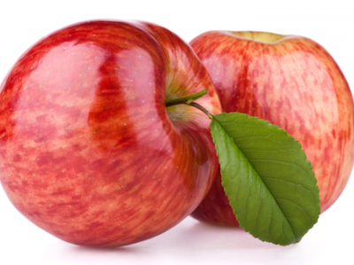

# CMRLibrary
Native library for cropping, resizing, and repositioning HTML images in JavaScript using only CSS
Нативная JavaScript библиотека для кадрирования, изменения размеров и позиционирования HTML изображений посредством CSS стилей.

## Подключение
Пример стандартного подключения:
```html
<head>
<!-- Подключение библиотеки -->
<link href="CMRLibrary.css" rel="stylesheet">
<script src="CMRLibrary.js"></script>
<!-- Конец подключения библиотеки -->
</head>
```
Библиотеку можно подключить и иным образом, главное, чтобы скрипт библиотеки был загружен до его непосредственного использования

## Структура библиотеки
Библиотека представляет собой объект, расположенный в глобальной области (в объекте окна), имеющий имя "CMR"
Объект CMR имеет следующую структуру:
```js
CMR Object {
  class ImageProcessor,
  function createImage,
  function createImageAsync
}
```

## CMR.ImageProcessor() constructor
Объект ImageProcessor отвечает за основую реализацию функционала библиотеки

**Синтаксис**
```js
new ImageProcessor(baseElement)
```

**Аргументы**

`Element` - Элемент контейнера изображения

**Пример**
```js
const base = document.getElementById("example");
const imageProcessor = new window.CMR.ImageProcessor(base);
```
Элемент основы "base" (контейнер) должен иметь следующую структуру:
```html
<div class="cmr-base" style="width: 800px; height: 600px;">
    <div class="cmr-rotation-base" style="transform: rotate(30deg);">
        
        <div class="cmr-real-crop" style="width: 505.731px; height: 363.512px; top: 120.488px; left: 156.269px;"></div>
    </div>
</div>
```

## CMR.ImageProcessor.prototype.getBase()
Метод-геттер, для определения элемента базы, над конторым осуществляет контроль объект

**Синтаксис**
```js
getBase()
```

**Возвращаемое значение**
`Element` - элемент основы

**Пример использования**
```js
const base = document.getElementById("example");
const imageProcessor = new window.CMR.ImageProcessor(base);

console.log(base === imageProcessor.getBase()); // expected output: true
```

## CMR.ImageProcessor.prototype.setCrop()
Метод для инициализации кадрирования (добавление элементов)

**Синтаксис**
```js
setCrop()
```

**Возвращаемое значение**
`Element` - элемент покрытия, который добавляется в элемент основы, посредством которого происходит управление

**Исключения**
> Error Instance was disposed - на объекте был вызван метод dispose(), завершающий его работу
> Error Crop is already exist - элемент покрытия уже существует

**Пример использования**
```js
const base = document.getElementById("example");
const imageProcessor = new window.CMR.ImageProcessor(base);
imageProcessor.setCrop();
```

## CMR.ImageProcessor.prototype.removeCrop()
Метод для удаления элемента покрытия (завершение редактирования)

**Синтаксис**
```js
removeCrop()
```

**Возвращаемое значение**
`undefined`

**Исключения**
> Error Instance was disposed - на объекте был вызван метод dispose(), завершающий его работу

**Пример использования**
```js
const base = document.getElementById("example");
const imageProcessor = new window.CMR.ImageProcessor(base);
imageProcessor.setCrop();
// some edits
imageProcessor.removeCrop();
```

## CMR.ImageProcessor.prototype.dispose()
Метод завершающий жизненный цикл объекта, после которого будет невозможно его повторно использовать
Удаляет элемент покрытия, если он был добавлен. Удаляет ссылку на себя в элементе основы

**Синтаксис**
```js
dispose()
```

**Возвращаемое значение**
`undefined`

**Исключения**
> Error - Instance was already disposed

**Пример использования**
```js
const base = document.getElementById("example");
const imageProcessor = new window.CMR.ImageProcessor(base);

// life circle
imageProcessor.setCrop();
// some edits
imageProcessor.removeCrop();

// life circle end
imageProcessor.dispose();
```

## get CMR.ImageProcessor.geometry
Свойства отображающее текущее состояние изображения
```js
{
    cropWidth: Float,
    cropHeight: Float,
    cropX: Float,
    cropY: Float,
    realCropEndX: Float,
    realCropEndY: Float,
    imageWidth: Float,
    imageHeight: Float,
    imageX: Float,
    imageY: Float,
    imageEndX: Float,
    imageEndY: Float,
    baseWidth: Float,
    baseHeight: Float,
    baseX: Float,
    baseY: Float,
    angle: Float,
    imageRatio: Float
}
```
